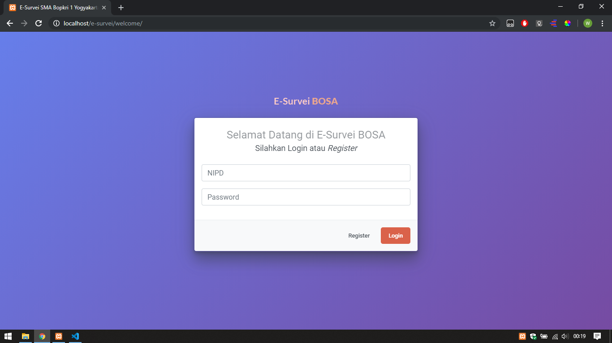
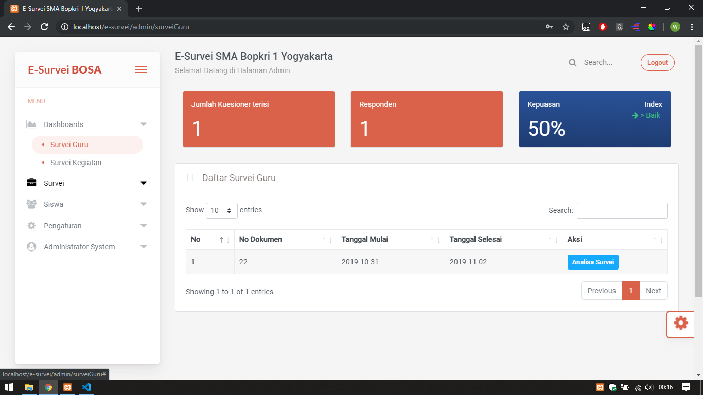

# e-survei
foot note :
- ganti database kelas jadi kategori_pengunjung, udah gw buatin tablenya, tinggal ntar ganti aja full kelas to katpengunjung di vscode
Proyek pembuatan e-survey dengan studi kasus SMA Bopkri 1 Yogyakarta
.
- proyek pembuatan e-survey untuk evaluasi guru dan evaluasi kegiatan SMA Bopkri 1 Yogyakarta
.
> Framework
* Codeigniter 3
* Bootstrap 4

> Login

> Admin Dashboard

